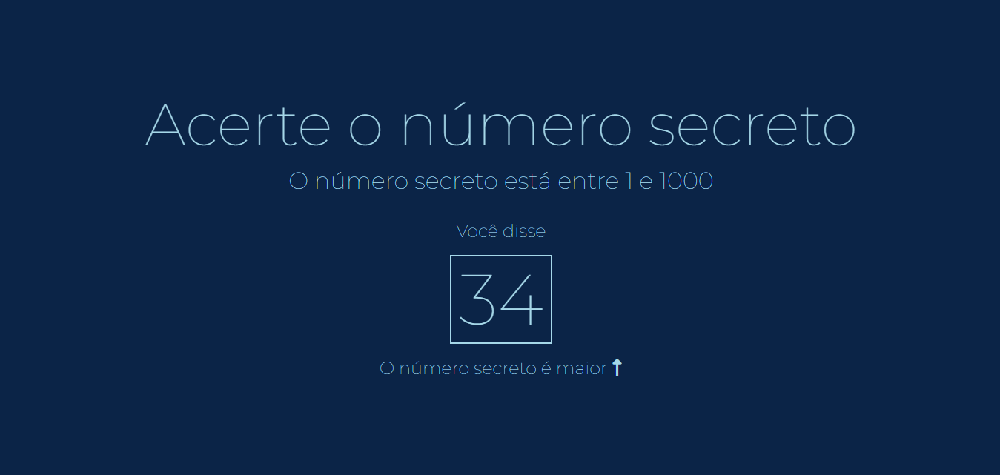
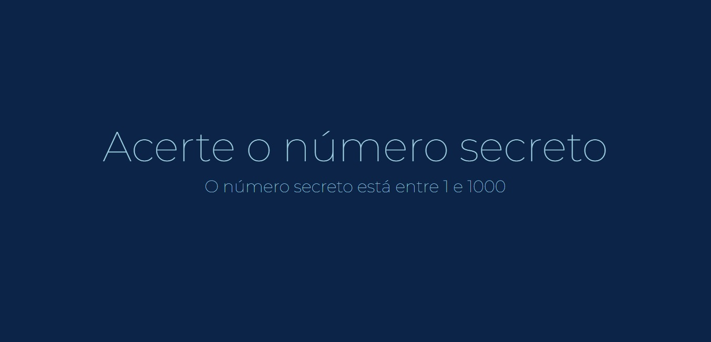
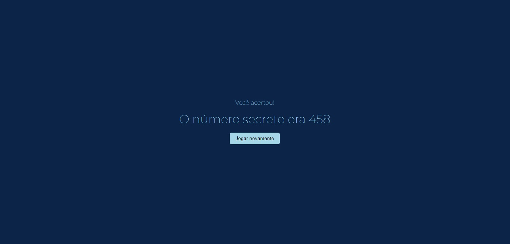

#Número Secreto - HTML/CSS/JS
-------------------------------------------------------------------------------

Projeto desenvolvido para encontrar um numero secreto através do reconhecimento de voz.

_________________________________________________________________________________

<h1>Tecnologias </h1>

Esse projeto foi desenvolvido com as seguintes tecnologias:

HTML 5
CSS 3
JS
API ( SpeechRecognition ) :
https://developer.mozilla.org/en-US/docs/Web/API/Web_Speech_API

_________________________________________________________________________________

<h1>Imagens</h1>

